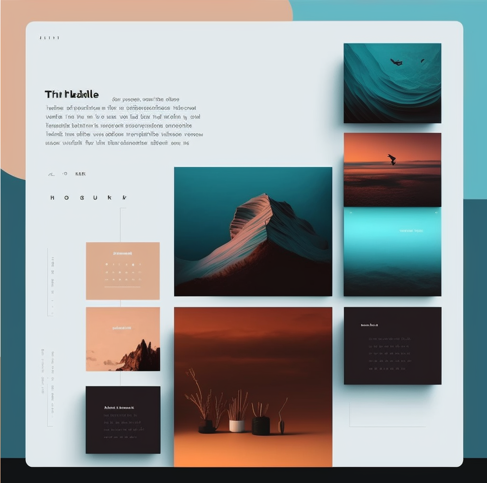

# Tileable
Personal utility website based on what what imagined by Midjourney!


### Built With


## Running locally

Then, run the development server:

```bash
npm install npm@latest -g
npm run dev
```

Open [http://localhost:3000](http://localhost:3000) with your browser to see the result.

This project uses [`next/font`](https://nextjs.org/docs/basic-features/font-optimization) to automatically optimize and load Inter, a custom Google Font.


## To-dos

- [x] Code generation page layout and chatGPT API setup
- [x] Music generation page layout and API setup
- [x] Usage limiter BLCs and UI component
- [ ] Landing page
- [x] Stripe setup
- [ ] Experiment with Next server actions for API routes

### Bugs
- [x] On the sidebar, the button order should match the button order in the dashboard
- [ ] When on Landing page and already signed in, the sign in/up buttons need to properly disapear
- [ ] In the Conversation page, the entered question needs proper spacing
- [ ] In the Conversation page, avatar and text in the conversation cards need proper alignment
- [ ] In the Conversation and Code page, AI and user avatars need to switch positions
- [ ] In dashboard page, I want the mobileSidebar to show free trial progress bar data
- [ ] In settings page, I want the subscribe/manage to open the correct links
- [ ] In stripe payment page after completion, I want to redirect to the correct page


<p align="right">(<a href="#readme-top">back to top</a>)</p>
